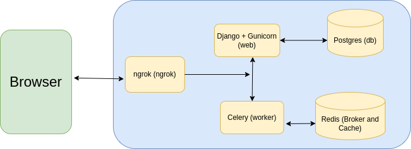

https://github.com/wicked-smart/Flight-Booking-API/assets/46626672/4dcaaa6d-e23b-4da5-817c-329c5fe003eb

# Flight-Booking-API


## Quick Introduction
* A Flight Booking REST API that let users search and book flight tickets (one-way/round-trip) across 1000+ Domestic and Interntional airports and different seat classes (Economy/Buisness/First class ) in 3-step (search, book and make payments , receive ticket in PDFs). 


## Infrastructure setup
* The API runs on docker compose having separate container for web (django), db (postgres), redis(redis as broker and cache) , worker(celery) and ngrok(ngrok).

    

* docker compose build session

    


## Features and Notes
*  Users get their API Key after they sign-up/register succesfully
* Allow users to search flights using 11+ filters like departure date, return date, flight number, origin city, airlines, flight duration, price etc. with response customised as per journey type (one-way/round-trip).
* Users can book the  flight ticket with passenger data like departure date, flight (departing and/or returning ), seat class etc. and receive **booking_ref** in return
*  Make payments using the **booking_ref** , validate the returned hooks url and click on the response link to receive ticket PDF
* Received PDF ticket contains information of the booking date and time, flight , journey type, baggage information, passenger allocated seats, fare rules and charges and finally , boarding instruction
* For round trip flight, if the return journey airline is different than departing one, separate tickets are generated while, if having same airline case..single ticket is generated.
* All these PDFs generation tasks are offloaded to celery workers to process it asynchronously and at scale.
* Allow users to cancel ticket , calculate appropriate cancellation charges based on difference between departing and cancelling datetime , issue refunds and refund receipt pdf.
* Also, Cancellation logic is customised for separate and single airline. For case of same airline, user has to explicitely state DEPARTING or RETURNING cancellation refund or BOTH.
* After validating stripe returned url , the internal django endpoint handles the webhook events like PaymentIntent Created , Succeeded, refunded etc.
* This architecture of exposing internal Dajngo endpoint rather than having separate Flask one to handle webhooks, shaves off around 70% response time giving very snappy user experience.
*  Various utility scripts like for initialising the database with airports data, formating date time in human readable format.
* Once user completes payment, seat is allocated as per his/her preferance (Window/Aisle/Middle). Bulk booking is also allowed but not more than max 10 at a time , subject to availability
* Users are allowed to add coupons availing discounts, check-in baggage information etc. while booking tickets
* If two passengers have same First, Middle and Last names, internally a UUID is allocated to each one to mark them unique
* API has been deployed to Heroku, with the generated PDFs uploaded to AWS S3 as heroku itself have ephemeral file system.
* For Payments , their is stripe integration with registed webhook events like payments intent created, succeeded, refunded etc.


## Future Work

* Optimise ORM queries/ use **select_related** and **prefetch_related** or maybe use **raw sql queries** to lower the overall response times 
* ‌Ability to add custom debit and credit cards as payment methods and do live payments
* Allow users to query on Stops and Layovers 
*  Also, Add feature to book **multi-city** flights

## Live Demo

 [![Video]](https://user-images.githubusercontent.com/46626672/278861072-4dcaaa6d-e23b-4da5-817c-329c5fe003eb.mp4)


## Link to Documentation

## How to Run and Test Locally

For this project to run locally, you need to install [docker](https://docs.docker.com/engine/install/) and [docker-compose](https://docs.docker.com/compose/install/).

After installing , clone this repo
```
$ git clone https://github.com/wicked-smart/Flight-Booking-API.git
$ cd Flight-Booking-API/

```

Then, simplly run the docker compose service to build and spin docker compose service
```
$ docker-compose -f docker-compose.prod.yml up -d --build 
```

Your api is up and running on http://localhost:8000/v1/flight_api/ .

Now visit  http://localhost:4040, find ngrok UUID and paste it in your stripe test API webhook settngs with url **<uuid>/webhook**

You can verify if it's working properly by runining and then looking the logs
```
$ docker-compose -f docker-compose.prod.yml logs -f
```

You can spin down the docker compose service by runing
```
$ docker-compose -f docker-compose.prod.yml down -v
```

 Check documentation to understand all the endpoints and launch postman to test different API endpoints 
